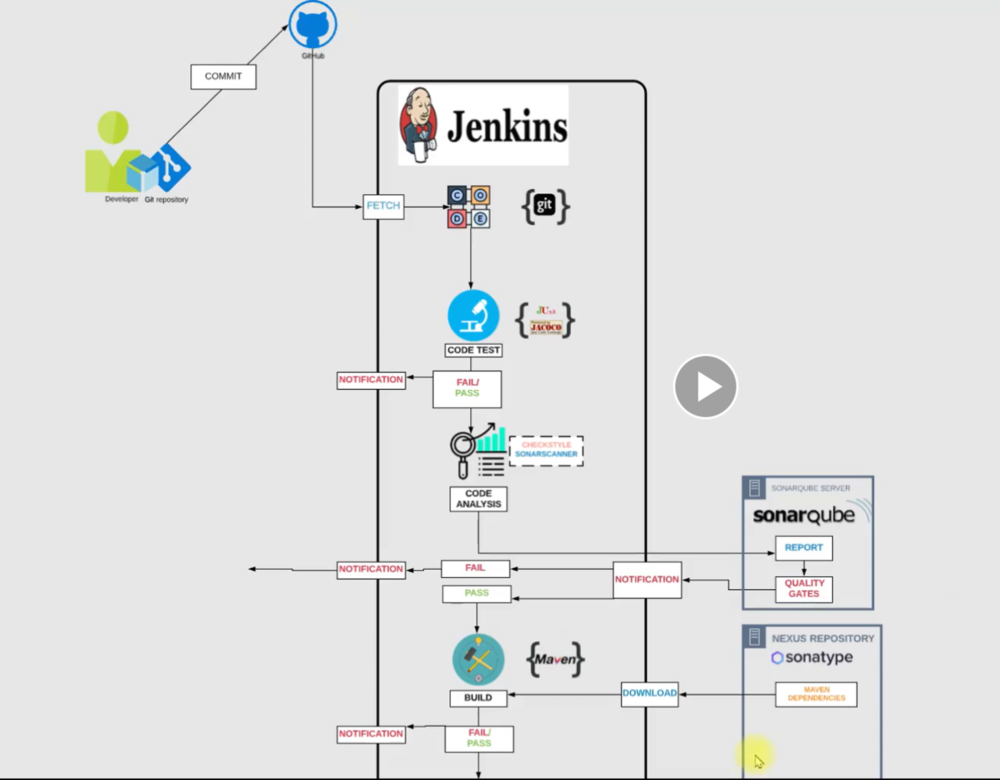
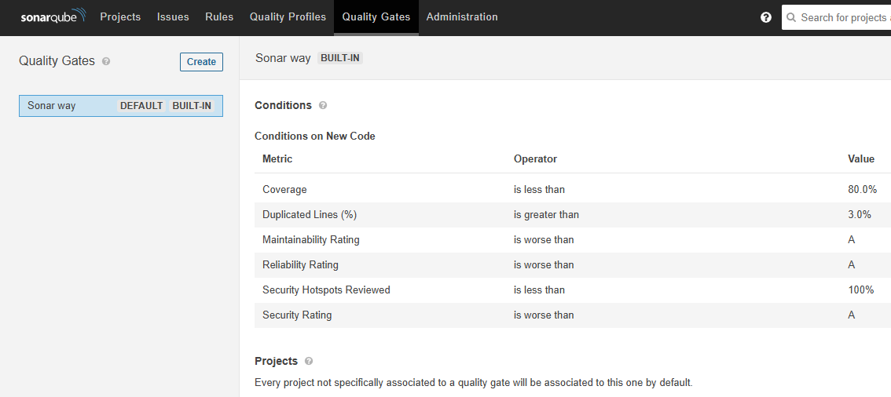
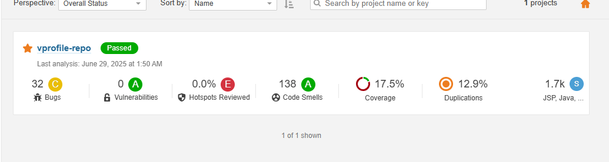
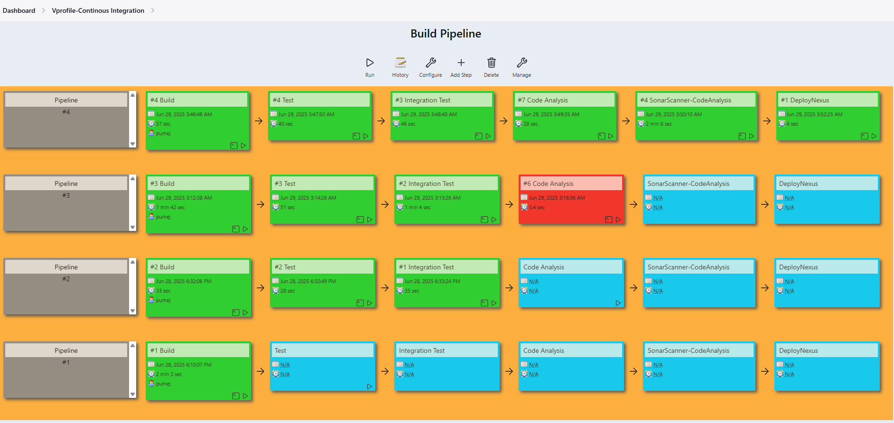

## CI/CD set up for a java application - vprofile.

- This project demostrates how to set up Nexus repository using VMs or an EC2 instance for a Java application project

## Project Infrasturcture 



### Pre-requisite Ensuer services are running on both VMs. Nexus service on port 8081 and Sonatqube service on port 9000

- Set up your VMs or provision an EC instance on AWS 
- I developed ansible playbooks for setting up Nexus server and Sonarqube servers on the VMs. 
- Use the ansible playbook to provision the required services on the VMs or EC instance 

```bash 
ssh-keygen   # Press Enter to accept default
ssh-copy-id ansibleUser@ipAddress                        | Used to copy your key to remote device or server for ansible user pumej
```
- Access the Nexus repository service on your server's ip address 

```bash
http://ipaddress:8081
```

## Create the corresonding repositories needed for our project - Vprofile java project

    - Created the below repositories 
        - vpro-maven-central        | This is where our project would download or access all dependencies for the project. This has been linked to maven repo URL - https://repo1.maven.org/maven2/. Created from maven proxy option. 
        - vpro-maven-group          | This repository is the group for all our other repos, created with maven2 group option. 
        - vprofile-release          | This is where all successfully built artifacts for our project would reside, created from maven hosted option.  
        - vprofile-snapshot         | This is where all snapshots for our project would be saved 

## Now we can create a sample build job in jenkins 

- Update the properties section of the goal with the variables in setting.xml file 

    SNAP-REPO=vprofile-snapshot
    NEXUS-USER=xxxyyy
    NEXUS-PASS=xxxyyy
    RELEASE-REPO=vprofile-release
    CENTRAL-REPO=vpro-maven-centrall
    NEXUS-GRP-REPO=vpro-maven-group
    NEXUSIP=192.168.248.134
    NEXUSPORT=8081

## Integrating Slack to jenkins for notification purposes 

    - Create a slack account and create a channel in your workspace 
    - Go to api.slack.com/apps and create an jenkins bot app and attach your workspace - Pumejlab for my case 
    - Go to oauth and permissions section and scroll down to Scopes and select chat:write
    - Then scroll back up and click install app to worksace and copy the token generated 
    - Go back to your jenkins console and install the slack plugin and also assign the credentials.
    - Also update the jenkins system configuration to use the custom bot server, add your workspace, and channel name. Test connection, you should get a success message. 
    - Now you can use the post notification features on your Build jobs. 

## Use below commands to clear up the Jenkins Server cache if you running in build issue 

    - This deletes the corrupted or stale cache of the maven-resources-plugin that is preventing Maven from retrying the download. After deleting it, the next build will reattempt fetching it from Nexus.

```bash
sudo rm -rf /var/lib/jenkins/.m2/repository
sudo rm -rf /var/lib/jenkins/.m2/repository/org/apache/maven/plugins/maven-resources-plugin
```

## You can create Build jobs to build your project and also add Unit and Integreation tests to your build job. You can make use of maven goals

```bash
mvn install -DskipTests
mvn verify -DskipTests
mvn Deploy
```

- Unit test 

    - Tests that check individual pieces of code in isolation — typically methods or classes — without external dependencies (e.g., databases, APIs).
    - Its purpose is to verify that each function or class works as expected in isolation. Commonly used tool is JUNIT or Mocktio.
    - Command used mvn test

- Integration Test

    - Tests that validate the interaction between multiple components — for example, a Java service interacting with a database or a REST API.
    - To check that modules or systems work together correctly., tools used JUNIT, Spring boot Test and REST-Assured 
    - Command used is mvn verify.

🧪 Summary

| Test Type        | Scope              | Dependency Involved | Maven Goal   |
| ---------------- | ------------------ | ------------------- | ------------ |
| Unit Test        | Individual methods | No external systems | `mvn test`   |
| Integration Test | Module interaction | Yes (e.g., DB, API) | `mvn verify` |

## Code Analysis section - Check Style format

- Used checkstyle plug in for running code analysis on the javaproject with the goal been the below command {}
- Use post build option "Record compiler warnings and static analysis results" and then select checkstyle from dropdown list 

```bash
mvn checkstyle:checkstyle               | File pattern would be **/checkstyle-result.xml
```

## Code Violations set up

- You can then use the Violations plugin to set some violations target so your project or pipeline can go into an unstable state if a certain target is met. 

    - To set this up use the Report Violations feature in post build section to set your target. No need to specify the file location 
    - The Violations result for each build of the code analysis would be displayed on the console for that build.  

## You can now integrate the code analysis job to the integration test job also. This would enable it to run post integration test. 

    - Use option, Build other projects to add the Code Analysis project to the Integration test job. 

## Adding Sonarqube tests to the Project 

    - You have to install the plugins Sonarqube scanner and Quality Gates plugin 
    - Configure the sonarqube scanner in Jenkins and also do same for Quality gates section
    - Generate token from your Sonarqube server under the my account section of the UI page. Take note of the token. Update it in Jenkins using secret and text format. 
    - Need to use same token for your sonarqube server 
    - Create the Build job for Sonarqube-codeanalysis, with the goal as install under add build step. Also add the checkstyle:checkstyle goal if you want. 
    - Create the project key and name in sonarqube UI interface, this would be used in the sonar properties. 
    - Choose option to "Execute Sonarqubescanner" from add build step option. Fill the required details, right server, update the sonarqube properties also. 
    - Run the job once updated and check the results. 

        - sonar properties sample

            sonar.projectKey=vprofile
            sonar.projectName=vprofile-repo
            sonar.projectVersion=1.0
            sonar.sources=src/
            sonar.java.binaries=target/test-classes/com/visualpathit/account/controllerTest/
            sonar.junit.reportsPath=target/surefire-reports/
            sonar.jacoco.reportsPath=target/jacoco.exec
            sonar.java.checkstyle.reportPaths=target/checkstyle-result.xml


- Was used to update the Java version on the Jenkins server which was compatible with the Sonarqube CLI. 

```bash
sudo nano /var/lib/jenkins/tools/hudson.plugins.sonar.SonarRunnerInstallation/sonarqube-scanner/bin/sonar-scanner
export JAVA_HOME=/usr/lib/jvm/java-11-openjdk-11.0.20.1.1-2.el9.x86_64
export PATH=$JAVA_HOME/bin:$PATH
```

## You can also set your own Qulaity Gate metrics from the Sonarqube server



- Create and name your own Quality gates option 
- Add your metrics with add condition button, set your qualitygate as default so it does not use the built in one. 
- Update jenkins sonarqube build job with a post build action - "Quality gate plugin".
- Run the job again and you should get the updated results and job should pass or fail per your set metrics 



## To upload our built artifacts, that is the vprofile.war file. 

- Have to install some plugins Copy, Zentimestamp for versioning and Nexus Artifact uploader.
- Create the Copy job (Deploy to Nexus) for uploading the files to the Nexus repository 
- From build section, select "copy artifacts from another project", file type = "**/*.war". Checkmark fingerprint artifacts. Also update the build job name thats generating the airtifacts
- Also update the "Nexus upload artifacts section, then add artifacts section also. 

## Lastly, build a full visualized pipeline with the jobs created 

- Install needed plug-ins like build pipeline, pipeline build etc 
- Create the pipeline view job for the entire build jobs by clicking on the plus icon 
- Fill out the required sections and then run the pipeline. 
- You should see sample pipeline in below picture running. 
- You can add the auto trigger so the pipeline starts the build using a git push command. Expose your jenkins server using ngrok and add the URL - https://73af-104-9-152-207.ngrok-free.app/github-webhook/ to webhook section of your repository. 
- Make sure to choose "GitHub hook trigger for GITScm polling" option on your build job. 

